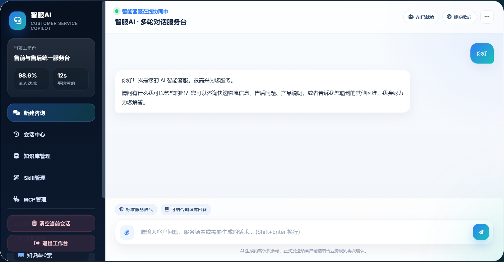
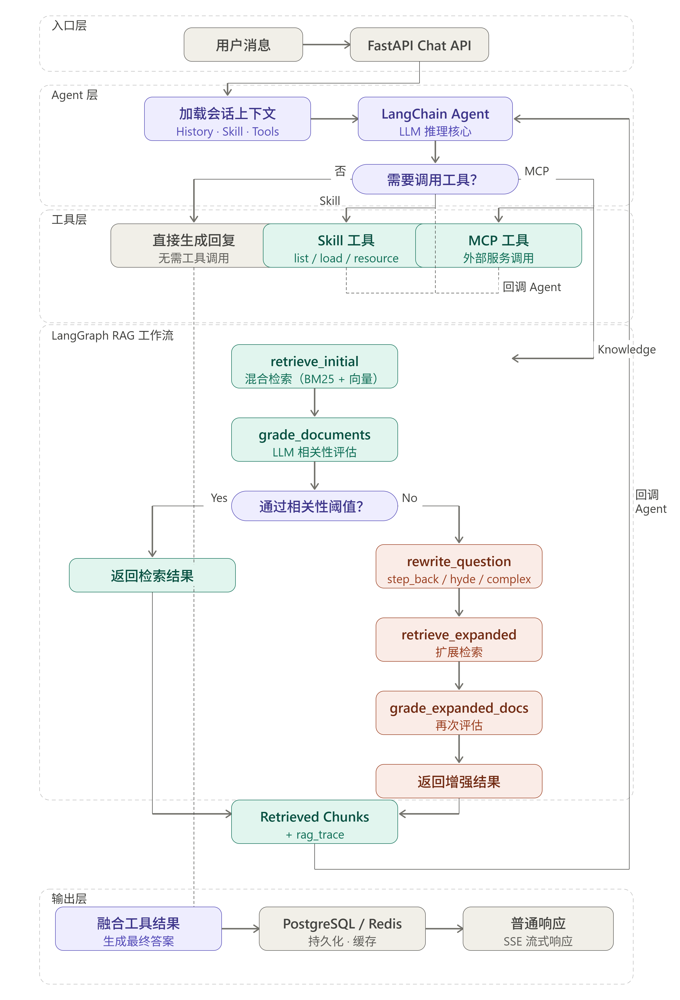
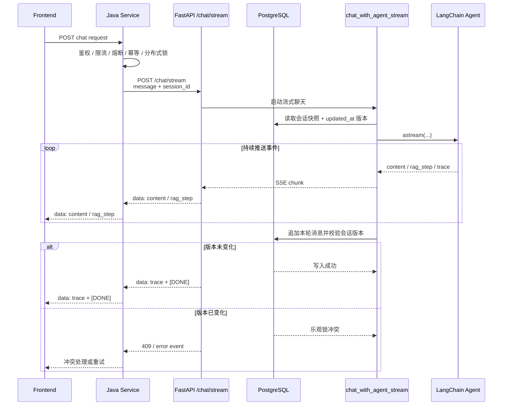

# 智服AI客服工作台

这是一个基于`FastAPI + LangChain + Milvus + PostgreSQL + Redis`的智能客服Agent项目，支持多轮对话、知识库检索增强、文档上传入库、Skill动态加载、MCP工具调用，以及面向业务人员的Web工作台。项目同时提供后端API和内置前端页面，适合用作以下场景的原型或内部系统基础：

## 应用场景

- 企业知识库问答
- 售前/售后客服辅助
- SOP 文档检索问答

## 效果展示



## 项目核心能力

- 多轮对话
  - 支持按用户维度进行会话隔离、持久化存储、历史溯源与清理
  - 支持标准同步响应与流式（Streaming）输出，保障极致且流畅的交互体验
- RAG 检索增强
  - 结合本地 Dense Embedding 与 BM25 Sparse Embedding，依托 Milvus 实现高性能向量检索
  - 内置混合召回、RRF（倒数秩融合）、Rerank（重排）、查询重写、Step-back 与 HyDE退回策略，大幅提升问答精度
- 文档知识库
  - 采用自动化三层分块策略，父级 Chunk 沉淀至 PostgreSQL 保证结构完整，叶子 Chunk 存入 Milvus 提升检索效率
  - 支持文档的异步解析、上传与删除，搭配前端实时进度反馈，保障大文件处理时系统的高吞吐与高可用
- 动态插件扩展
  - 支持通过 ZIP 包一键上传 Skill，系统自动扫描并解析 `SKILL.md` 及关联资源，实现能力的快速接入
  - 支持集成 Model Context Protocol (MCP) Server，通过统一接口无缝对接外部工具集
  - 智能体可根据对话意图，按需自动发现、动态加载并复用 Skill 与 MCP 上下文，实现无缝的业务功能扩展
- 权限体系
  - 提供完整的注册与登录闭环，基于 JWT 实现安全、可靠的无状态接口鉴权
  - 无缝集成登录鉴权、智能对话、会话中心、知识管理及插件配置等核心业务模块


## 技术栈

- 后端：`FastAPI`、`SQLAlchemy`、`Uvicorn`
- Agent：`LangChain`、`LangGraph`、`langchain-mcp-adapters`
- 向量库：`Milvus`
- 关系型存储：`PostgreSQL`
- 缓存：`Redis`
- Embedding：本地 `bge-m3` 模型 + `BM25 sparse embedding`
- 前端：原生 `HTML + CSS + JavaScript`，通过 `Vue 3 CDN` 增强交互

## 系统架构

```text
Frontend Workbench
        |
        v
     FastAPI
        |
        +-- Auth / Session / Chat API
        +-- Document Upload / Delete API
        +-- Skill Management API
        +-- MCP Server Management API
        |
        v
   LangChain Agent
        |
        +-- search_knowledge_base
        +-- list_skills / load_skill / load_skill_resource
        +-- Dynamic MCP Tools (via MultiServerMCPClient)
        |
        v
   RAG Pipeline
        |
        +-- Dense Embedding (local bge-m3)
        +-- Sparse Embedding (BM25)
        +-- Hybrid Retrieve / Rerank / Auto-merge
        |
        +-- Milvus        -> leaf chunks
        +-- PostgreSQL    -> users, sessions, parent chunks, MCP configs
        +-- Redis         -> conversation cache
```

## 工作流图

下面这张图基于当前项目实际代码整理：主对话由 `LangChain Agent` 驱动；当 Agent 调用 `search_knowledge_base` 时，会进入 `LangGraph` 编排的 RAG 子流程。



## `/chat/stream` 时序图

下面这张时序图只描述 Python Agent 微服务内部的流式聊天处理链路。请求级鉴权、限流、熔断、幂等与分布式锁由上游 Java 服务负责；Python 侧专注 Agent 生成、RAG/Tool/MCP 调用，以及会话写入时的乐观锁保护。



## 目录结构

```text
agent/
├─ app.py                         # 兼容启动入口，转发到 backend.app.main
├─ backend/
│  └─ app/
│     ├─ main.py                  # FastAPI 应用组装与静态资源挂载
│     ├─ schemas.py               # 全部 API 的 Pydantic 请求/响应模型
│     ├─ tools.py                 # 暴露给 Agent 的 LangChain 工具集合
│     ├─ api/
│     │  ├─ _shared.py            # API 共享通用函数
│     │  ├─ auth.py               # 认证相关接口
│     │  ├─ chat.py               # 聊天与会话相关接口
│     │  ├─ documents.py          # 文档上传、删除与任务查询接口
│     │  ├─ mcp.py                # MCP Server 管理接口
│     │  ├─ skills.py             # Skill 技能包管理接口
│     │  └─ router.py             # HTTP 路由聚合入口
│     ├─ core/
│     │  ├─ config.py             # 环境变量读取与全局配置
│     │  ├─ security.py           # JWT、密码哈希、角色权限、依赖注入
│     │  └─ cache.py              # Redis 缓存封装
│     ├─ db/
│     │  ├─ session.py            # SQLAlchemy Engine、SessionLocal、Base、init_db
│     │  └─ models.py             # 用户、会话、消息、父级分块、MCP 配置等 ORM 模型
│     ├─ services/
│     │  └─ agent_service.py      # LangChain Agent、MCP 工具装配、会话存储逻辑
│     ├─ rag/
│     │  ├─ document_loader.py    # PDF/Word/Excel 文档解析与三级分块
│     │  ├─ rag_pipeline.py       # LangGraph RAG 编排流程
│     │  ├─ rag_utils.py          # 检索、重排、查询扩展、Auto-merging 等工具
│     │  └─ parent_chunk_store.py # 父级分块在 PostgreSQL + Redis 中的持久化封装
│     ├─ integrations/
│     │  ├─ embedding.py          # 本地 dense embedding + BM25 sparse embedding
│     │  ├─ milvus_client.py      # Milvus 连接、建表、查询、删除封装
│     │  └─ milvus_writer.py      # 文档向量写入 Milvus
│     ├─ jobs/
│     │  └─ upload_jobs.py        # 上传/删除任务状态管理与进度跟踪
│     └─ skills/
│        └─ skill_loader.py       # Skill 扫描、frontmatter 解析、资源加载
├─ frontend/
│  ├─ index.html                  # 工作台页面骨架
│  ├─ script.js                   # 前端交互逻辑、接口调用、状态管理
│  ├─ style.css                   # 页面样式
│  └─ favicon.ico                 # 站点图标
├─ skills/                        # 外部 Skill 根目录，每个子目录一个技能包
├─ .env                           # 本地开发环境变量
├─ .env.example                   # 环境变量示例
├─ docker-compose.yml             # 本地依赖服务编排
└─ README.md                      # 项目说明文档
```

## 核心能力说明

### 1. 对话能力

- 用户登录后可创建和维护自己的会话
- 对话消息存储在 PostgreSQL 中
- Redis 用于缓存消息与会话元数据
- 支持 `/chat` 普通响应和 `/chat/stream` SSE 流式响应
- Python Agent 服务不再承担请求级幂等控制；鉴权、限流、熔断、幂等与分布式锁由上游 Java 服务负责
- 当一个窗口中的历史对话过长时，agent会自动进行会话摘要，减少上下文长度

### 2. 知识库能力

- 上传业务文档后，系统会自动执行三级分块
- 叶子分块写入 Milvus，用于检索
- 父级分块写入 PostgreSQL，用于 Auto-merging 场景
- 检索链路支持：
  - Hybrid Retrieval
  - RRF 融合
  - DashScope Rerank
  - 查询重写
  - Step-back 问题扩展
  - HyDE 假设文档扩展

### 3. Skill 能力

Skill 目录约定如下：

```text
skills/
└─ your-skill/
   ├─ SKILL.md
   ├─ references/
   ├─ assets/
   └─ scripts/
```

其中：

- `SKILL.md` 是入口文件
- 支持在 frontmatter 中定义 `name`、`description`、`references`
- Agent 可以通过工具动态读取 Skill 内容和资源文件

### 4. MCP 工具调用能力

- 支持集成 Model Context Protocol (MCP) Server，通过 `langchain-mcp-adapters` 将其暴露给 Agent
- 支持动态管理 MCP 配置，包括名称、传输方式（`stdio` / `sse`）、命令、环境变量等
- 在运行时给 MCP 工具自动注入元数据标签，以便 Agent 区分并高效使用


## API 概览

### 认证

- `POST /auth/register`：注册账号
- `POST /auth/login`：登录
- `GET /auth/me`：获取当前用户信息

### 会话

- `GET /sessions`：获取当前用户会话列表
- `GET /sessions/{session_id}`：获取指定会话消息
- `DELETE /sessions/{session_id}`：删除会话

### 聊天

- `POST /chat`：普通聊天
- `POST /chat/stream`：流式聊天

### 文档知识库

- `GET /documents`：获取文档列表
- `POST /documents/upload`：同步上传文档
- `POST /documents/upload/async`：异步上传文档
- `GET /documents/upload/jobs`：获取上传任务列表
- `GET /documents/upload/jobs/{job_id}`：获取上传任务详情
- `DELETE /documents/{filename}`：删除文档向量数据
- `DELETE /documents/delete/async/{filename}`：异步删除文档
- `GET /documents/delete/jobs/{job_id}`：获取删除任务详情

### Skill 管理

- `GET /admin/skills`：获取 Skill 列表
- `POST /admin/skills/upload`：上传 Skill zip 包

### MCP 管理

- `GET /admin/mcp-servers`：获取 MCP Server 列表
- `POST /admin/mcp-servers`：创建/上传 MCP Server 配置
- `PUT /admin/mcp-servers/{server_id}`：更新 MCP Server 配置
- `DELETE /admin/mcp-servers/{server_id}`：删除 MCP Server

## 前端说明

前端资源位于 `frontend/` 目录，由 FastAPI 直接托管，包含：

- 登录 / 注册面板
- 聊天工作台
- 历史会话中心
- 管理员知识库管理面板
- 管理员 Skill 管理面板
- 流式回答和检索过程可视化

因此这个项目默认是“单体交付”风格：后端 API 和前端页面一起运行，不需要再单独起一个前端开发服务器。

## 致谢
本项目基于 [icey1287/SuperMew](https://github.com/icey1287/SuperMew) 二次开发，感谢原作者的开源贡献。
在原有基础上新增/优化了以下特性：
1. 优化了 BM25 的 Tokenizer 方法：先用正则切分中英文片段，中文片段交由 jieba 分词，英文/数字片段整体保留，最终用于 BM25 稀疏向量构建
2. Skill模块化扩展：支持将客服话术、业务规则、处理流程和参考资料封装为独立Skill。Agent可根据用户任务动态发现并加载对应Skill，在不改动主对话流程的情况下扩展新能力，提升回答的专业性和可维护性
3. MCP模块化扩展：支持 Agent 在运行时根据 stdio 或 Streamable HTPP 模式动态调用外部 MCP Server 的能力
4. 使用 ContextVar 管理请求级上下文，替代简单全局变量，避免并发场景下的上下文污染，提升异步对话链路的隔离性和稳定性
5. 优化了 RAG 模型单例初始化机制：为_stepback_model、 _grader_model 和 _router_model增加带锁的懒初始化，避免高并发首次访问时重复创建模型实例，提升 RAG 链路在并发场景下的稳定性与资源利用效率
6. 调整服务职责边界：请求级鉴权、限流、熔断、幂等与分布式锁交由上游 Java 服务负责，Python Agent 服务专注回答生成、RAG/Tool/MCP 调用，并通过会话版本戳保护会话写入一致性

## 许可证
MIT License
